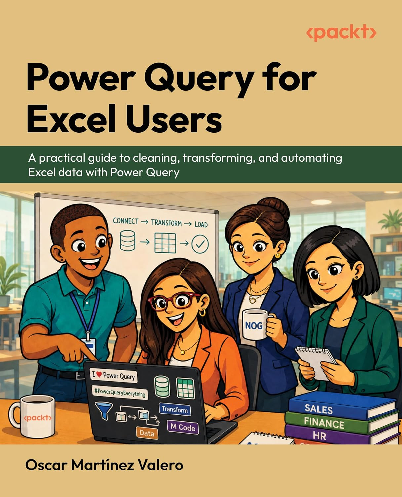

# Power Query for Excel and Business Users

**A Hands-On Office Casebook and Guide to Clean, Trusted, and Repeatable Data**

Published by Packt | By Oscar Martínez



---

## About the Book

If you spend hours every week copying, cleaning, and combining spreadsheets, Power Query will change how you work, permanently.

This book follows Quinn, a newly hired data analyst at Northbridge Office Group (NOG), through realistic business scenarios that any office professional will recognise. Each chapter delivers a concrete, refreshable output, and builds toward a connected Events data model you can actually use.

No coding required. If you can open Excel, you are ready to start.

[Buy the book on Amazon](https://www.amazon.com/Power-Query-Excel-Users-transforming-ebook/dp/B0H3K9YHJG) | [Packt page](https://www.packtpub.com/en-ch/product/power-query-for-excel-users-9781807427726)

---

## About This Repository

This repository contains the **NOG-DataHub exercise files** used throughout the book. They simulate the data environment at Northbridge Office Group, the fictional company where Quinn works.

Download the files, point Power Query at the folder on your machine or SharePoint site, and follow along chapter by chapter.

Have a question about an exercise? Stuck on a step? Want to share something you built? Use the [Discussions tab](https://github.com/PacktPublishing/Power-Query-for-Excel-Users/discussions).

---

## How to Get Started

**Option A: SharePoint (recommended)**

1. Download this repository as a ZIP file and extract it.
2. Upload the `NOG-DataHub` folder to a SharePoint document library.
3. Note the SharePoint site URL — you will use it in the Power Query Folder connector throughout the book.

**Option B: Local folder**

1. Download this repository as a ZIP file and extract it.
2. Place the `NOG-DataHub` folder somewhere accessible, such as `C:\NOG-DataHub` or `Documents\NOG-DataHub`.
3. Note the full folder path — you will use it in the Local Folder connector throughout the book.

The book covers both options in every chapter, so either works perfectly.

> [!TIP]
> Before starting each new chapter, copy your current NOG-DataHub workbook and rename it for the chapter you are about to begin, for example `NOG-DataHub_Ch05.xlsx`. This gives you a clean starting point that already contains everything built so far, and a fallback you can return to if anything goes wrong.

---

## Chapter-to-File Map

| Chapter | Files Used |
|---------|-----------|
| 1 | `Quick Tour/Demo_ProductList.xlsx`, `Quick Tour/Demo_OrderSample.csv` |
| 2 | `Reference/Contacts.csv` |
| 3 | `Events/Sessions/Sessions_2025-10.xlsx` to `Sessions_2026-01.xlsx`, `Reference/Map_Facilitators.xlsx` |
| 4 | `Events/KPIs/Weekly_Event_KPIs.xlsx` |
| 5 | `Events/KPIs/Weekly_Event_KPIs.xlsx` |
| 6 | `Events/Registrations/Registrations_2025-10.xlsx` to `Registrations_2026-01.xlsx` |
| 7 | `Events/Attendance/Attendance_2025-10.xlsx` to `Attendance_2026-01.xlsx` |
| 8 | Queries built in Chapters 6 and 7 |
| 9 | `Events/Payments/Payments_Transactions.xlsx` |
| 10 | Queries built in previous chapters |
| 11 | Queries built in previous chapters |
| 12 | Queries built in previous chapters |

---

## Folder Structure

```
NOG-DataHub/
├── Quick Tour/                   # Chapter 1 practice files
│   ├── Demo_ProductList.xlsx
│   └── Demo_OrderSample.csv
│
├── Reference/                    # Chapters 2 and 3
│   ├── Contacts.csv
│   └── Map_Facilitators.xlsx
│
└── Events/                       # Chapters 3 to 12
    ├── Sessions/                 # Chapter 3 — Master_Sessions
    │   ├── Sessions_2025-10.xlsx
    │   ├── Sessions_2025-11.xlsx
    │   ├── Sessions_2025-12.xlsx
    │   └── Sessions_2026-01.xlsx
    │
    ├── KPIs/                     # Chapters 4 and 5 — Weekly_Event_KPIs
    │   └── Weekly_Event_KPIs.xlsx
    │
    ├── Registrations/            # Chapter 6 — Registrations_Combined
    │   ├── Registrations_2025-10.xlsx
    │   ├── Registrations_2025-11.xlsx
    │   ├── Registrations_2025-12.xlsx
    │   └── Registrations_2026-01.xlsx
    │
    ├── Attendance/               # Chapter 7 — Sessions_Attendance
    │   ├── Attendance_2025-10.xlsx
    │   ├── Attendance_2025-11.xlsx
    │   ├── Attendance_2025-12.xlsx
    │   └── Attendance_2026-01.xlsx
    │
    └── Payments/                 # Chapter 9 — Master_Payments
        └── Payments_Transactions.xlsx
```

---

## Software Requirements

- **Microsoft Excel 2016 or later** with Power Query (available via **Data > Get & Transform Data**)
- Excel for Microsoft 365 is recommended for the latest Power Query features
- No additional software required

---

## About the Author

Oscar Martínez is a BI team leader, Microsoft-certified Fabric Analytics Engineer and Power BI Data Analyst, and founder of [bibb](https://bibb.pro), home of the web's most popular Power BI Theme Generator, used by more than 80,000 practitioners a year. But he spent the first decade of his career where many of his readers are today: working in finance, buried in spreadsheets, cleaning the same data every month. Power Query changed that, and eventually changed his career.

He writes a newsletter on Microsoft data tools read by 17,000 subscribers. Find him at [bibb.pro](https://bibb.pro).

---

## Errata and Support

If you find an error in the book or have a question about the exercise files, please open an issue in this repository or visit the [Packt support page](https://www.packtpub.com/support).

---

*Published by Packt Publishing. All exercise data is fictional and created solely for educational purposes.*
